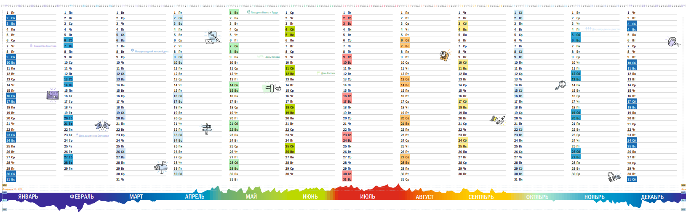

# 🎨 Month Color Palette

**Temperature-based color encoding for WallPlan calendars**

---

## 💡 Concept

WallPlan uses a **temperature-based color palette** to visually encode the time of year.
When enabled, month names, day numbers, and day-of-week labels are colored according to a seasonal gradient — from the dead black of January to the fiery red of July and back to the gray overcast of December.

The metaphor is simple: **color = temperature**. You feel the year at a glance.

The first version of this color scheme was applied in the [original two-year calendar (October 2012)](https://app.box.com/s/7yqyh8vfphq9hj2lg1jw), published in the Russian magazine [«Жить интересно!»](https://interesno.co/). That calendar marked the beginning of the WallPlan project.



---

## 🗺️ Color Map

| #  | Month     | Hex       | Color        | Rationale                          |
|----|-----------|-----------|--------------|-------------------------------------|
| 1  | January   | `#212121` | Black        | Darkest, coldest month              |
| 2  | February  | `#3F51B5` | Indigo       | Deep winter cold                    |
| 3  | March     | `#9C27B0` | Purple       | Transition — still cold, awakening  |
| 4  | April     | `#2196F3` | Blue         | Cool spring, melting snow           |
| 5  | May       | `#4CAF50` | Green        | Nature blooms, warmth arrives       |
| 6  | June      | `#8BC34A` | Lime         | Warm, lush greenery                 |
| 7  | July      | `#F44336` | Red          | Peak heat 🔥                        |
| 8  | August    | `#FF9800` | Orange       | Hot, late summer                    |
| 9  | September | `#FFC107` | Amber        | Warm fading, golden light           |
| 10 | October   | `#A1887F` | Light Brown  | Autumn leaves, cooling              |
| 11 | November  | `#795548` | Brown        | Late autumn, bare trees             |
| 12 | December  | `#9E9E9E` | Gray         | Cold, overcast skies                |

### Visual Cycle

```
Jan  Feb  Mar  Apr  May  Jun  Jul  Aug  Sep  Oct  Nov  Dec
 ⬛   🟦   🟪   🔵   🟩   🟢   🔴   🟠   🟡   🟫   🟫   ⬜
cold →→→→→→→→ warm →→→→ HOT →→→→ warm →→→→→→→→ cold
```

---

## 🌡️ Climate Interpretation

The palette reflects real Northern Hemisphere climate — warmth starts only in May, just like in real life. April's blue emphasizes that spring ≠ warmth.

| Month | Color | Meaning |
|-------|-------|---------|
| Янв ⬛ | Black | Dead cold, darkness |
| Фев 💙 | Indigo | Winter depth |
| Мар 💜 | Purple | Crocuses! First flowers, but still cold |
| Апр 🔵 | Blue | Still cold, rain |
| Май 💚 | Green | Finally warm, nature comes alive |
| Июн 🌱 | Lime | Summer, everything lush |
| Июл ❤️ | Red | HEAT! |
| Авг 🧡 | Orange | Hot, but peak is over |
| Сен 💛 | Amber | Golden autumn |
| Окт 🍂 | Light Brown | Falling leaves |
| Ноя 🪵 | Brown | Bare trees |
| Дек ⬜ | Gray | Overcast, snow |

---

## ⚙️ Usage

- **Toggle**: Click the color button in the toolbar (concentric circles → Itten wheel)
- **URL parameter**: `?c=1` enables colors, absence = monochrome
- **SVG/PDF export**: Colors are embedded as inline `style.fill` to override CSS defaults
- **Weekend rule**: Weekend days remain **red** (`#C41E3A`) regardless of month color
- **Miro app**: Colors are always enabled (no toggle UI)

---

## 🏗️ Design Decisions

1. **Material Design palette** — all colors are from Google's Material Design color set
   for consistency and readability
2. **Inline styles** — `style="fill:..."` is used instead of `fill="..."` attribute
   to ensure colors override the base CSS rule `text { fill: #2C2C2C }`
3. **Temperature metaphor** — the gradient follows the Northern Hemisphere seasonal
   temperature curve, making it intuitive for most users
4. **1-indexed array** — `MONTH_COLORS[0]` is empty; months use natural numbering (1–12)
   in `calendar.js`, and 0-indexed (0–11) in `miro-app/src/svg-renderer.ts`

---

## 📁 Files

| File | Role |
|------|------|
| `calendar.js` | `MONTH_COLORS[]`, `toggleMonthColors()`, `_syncColorIcons()` |
| `index.html` | Toggle button with `icon-mono` / `icon-color` SVGs |
| `for-kirill-specially-ru/calendar-ru.js` | Same palette, RU locale |
| `for-kirill-specially-ru/index.html` | Same toggle button, RU locale |
| `miro-app/src/svg-renderer.ts` | Always-on colors for Miro board SVG |

---

## 📚 Publications

- [Expanding Planning Horizons](https://osowski.medium.com/calendar-392272c97af3) — how multi-year calendars changed the way I plan
- [Game: Strategy Visualization](https://osovsky.medium.com/game-5438c730a15e) — using wall calendars for strategic thinking
- [Original two-year calendar (2012)](https://app.box.com/s/7yqyh8vfphq9hj2lg1jw) — the file where this color scheme was first applied
- [Evgeniya Shamis on using the 2013–2014 calendar](https://youtu.be/y7rua9C81Ng?si=wgnVbWqXtwPECbqp) — [Evgeniya Shamis](https://www.linkedin.com/in/evgeniya-shamis-572316/) shares how she uses the printed calendar (gifted in 2012)

---

## 🙏 Acknowledgements

- [Elena Rychagova](https://www.linkedin.com/in/%D0%B5%D0%BB%D0%B5%D0%BD%D0%B0-%D1%80%D1%8B%D1%87%D0%B0%D0%B3%D0%BE%D0%B2%D0%B0-15886989/) — editor at [Scriber](https://scriber.biz/), published the original calendar in «Жить интересно!» magazine

---

## 📄 License

© 2012–2026 [Maxim Osovsky](https://www.wikidata.org/wiki/Q107189449).
Licensed under [CC BY-SA 4.0](https://creativecommons.org/licenses/by-sa/4.0/).
