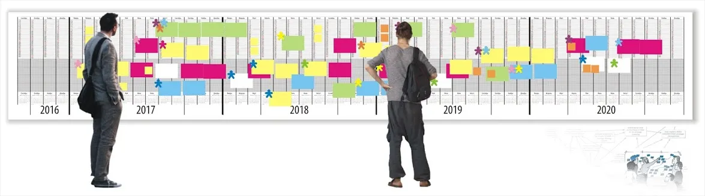

# WallPlan — Calendar Generator for Long-Term Planning

📅 Every year I publish a new version of a multi-year calendar. The publishing industry mostly makes calendars for just the next year, limiting our ability to plan in detail many years ahead.

Twelve years ago, in October 2014 I [released](https://app.box.com/s/7yqyh8vfphq9hj2lg1jw) the first such calendar covering two years.
🚇 For many years we laid out calendars manually, until in 2020, [Michael Kvrivishvili](https://wayfinding.pro/cal/?l=6) — the designer of the official Boston Metro map — developed a service specifically for me to generate a calendar for any number of months, with any number of Gantt rows.

## 🌟 Features

- **Precision Layout**: Automatically fits 7 or 8 months per page perfectly on any paper width (A4/A3). Multi-page output shown side-by-side.
- **Flexible Modes**: Vertical (classic), Gantt (horizontal timeline), Years (multi-year).
- **Paper Sizes**: A4, A3, 914mm (single roll), 914mm ×2, 914mm ×4.
- **Customizable**: Week start (Mon/Sun), US Federal Holidays, adjustable rows (5–15).
- **Print Optimized**: Custom print CSS — what you see is what you get.
- **Rulers & Guides**: Measurement rulers with cm/m labels, vertical guides marking printable area.

## 🖨️ Printing

📌 Long multi-year calendars can be printed at copy centers on **engineering paper up to 1 m wide** with virtually infinite length.

🚀 Ideal for working on [strategies](https://osovsky.medium.com/game-5438c730a15e)!

## 📐 Architecture

See [architecture.md](./architecture.md) for detailed technical documentation on the layout engine and codebase structure.

## 🙏🏻 Credits

**2014-2026 [Michael Kvrivishvili](https://www.linkedin.com/in/michael-kvrivishvili-39ab062/), Maxim Osovsky**.
This work is licensed under the **Creative Commons Attribution-ShareAlike 4.0 International License (CC BY-SA 4.0)**.
