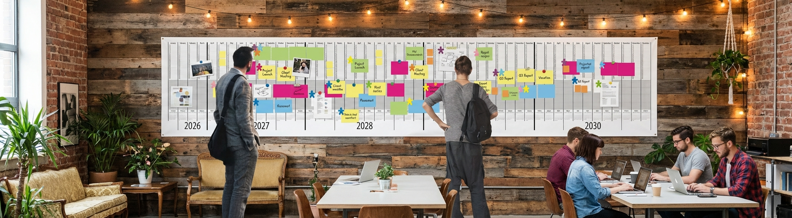

<div align="center">

# 📅 WallPlan

**Print years on paper — plan decades ahead**

[](https://osovsky.com/wallplan/)
[](https://creativecommons.org/licenses/by-sa/4.0/)

A browser-based multi-year calendar generator with Gantt-style grid, vertical day lists, and mini month boxes. Configure duration, paper size, export to SVG or PDF, and print on large format paper.

**Zero dependencies · No login · 100% private**



</div>

---

## 💡 Concept

> Fourteen years ago, in October 2012, I [released](https://app.box.com/s/7yqyh8vfphq9hj2lg1jw) the first multi-year calendar covering two years. The publishing industry mostly makes calendars for just the next year, limiting our ability to plan in detail many years ahead. In 2020, [Michael Kvrivishvili](https://wayfinding.pro/cal/?l=6) — the designer of the official Boston Metro map — developed a service specifically for me to generate a calendar for any number of months, with any number of Gantt rows.

### Purpose
- **📏 Long-term planning** — see months and years at a glance on a single paper roll
- **📊 Gantt-style tracking** — horizontal rows for projects, goals, habits, and deadlines
- **🖨️ Wall printing** — designed for large format printing at copy centers (up to 1m wide, unlimited length)
- **🎯 Strategic thinking** — ideal for working on [strategies](https://osovsky.medium.com/game-5438c730a15e)

### Target Audience
- **Managers & strategists** — roadmap planning, project timelines, OKR tracking
- **Entrepreneurs** — business milestones, fundraising timelines, product launches
- **Personal planners** — life goals, habit tracking, family calendars
- **Teams & offices** — shared wall calendars for departments and projects

---

## ✨ Features

| Feature | Description |
|---------|-------------|
| **SVG Renderer** | Pure SVG output — Vertical (days list), Gantt (planning grid), Box (mini months) |
| **Duration** | From 1 month to 20 years. Mobile scroll-wheel picker, desktop number input |
| **Hide Days mode** | Toggle to hide day-level details — only year/quarter/month divisions remain. URL: `&d=1` |
| **Paper sizes** | A4, A3, 914mm (single), 914mm ×2 (dual), 914mm ×4 (quad). Roll length displayed |
| **Precision layout** | Auto-fits 7–8 months per page on A4/A3. Roll paper uses cell-width-driven calculation |
| **Format tuning** | Optimized cell widths per format — 4mm (single), 2.7mm (×2), 1.7mm (×4) |
| **PDF & SVG export** | Embedded IBM Plex Sans fonts, parallel font loading |
| **Custom entries** | Add annotations via **W** button: `DD.MM` format, yearly repeat, exported to SVG/PDF |
| **Holidays** | US Federal Holidays, WallPlan Day (Jan 11) in Copper Penny DTP font |
| **Month colors** | Temperature-based [color palette](./COLORS.md) — toggle via toolbar button. URL: `&c=1` |
| **Week start** | Monday or Sunday toggle |
| **Gantt rows** | 6, 8, 10, or 12 configurable rows |
| **Mobile-first** | 6-column grid toolbar with frosted glass, settings sheet, scroll-wheel pickers |
| **Touch gestures** | Pan, pinch-to-zoom on mobile |
| **Welcome carousel** | 4-slide onboarding on first mobile visit (localStorage gated) |
| **Rulers & guides** | Measurement rulers with cm/m labels, vertical guides for printable area |
| **Print optimized** | Custom print CSS — what you see is what you get |
| **Private** | All data stays in browser, never sent anywhere |
| **Zero dependencies** | No npm, no framework, pure vanilla JS |
| **Miro App** | Native Miro board elements via [wallplan-miro](https://github.com/maximosovsky/wallplan-miro) — progressive rendering, batch optimized |
| **Miroverse** | [2-Year Timeline Gantt Calendar](https://miro.com/miroverse/2year-timeline-gantt-calendar-20262027/) — ready-to-use template |

---

## 🚀 Quick Start

```bash
npx -y serve -l 3456
# Open http://localhost:3456
```

Or visit the live version:
- [osovsky.com/wallplan](https://osovsky.com/wallplan/) — primary
- [wallplan on GitHub Pages](https://maximosovsky.github.io/wallplan/) — mirror

---

## 🎛️ Controls

### Desktop

| Control | Action |
|---------|--------|
| **Months input** | Set calendar duration (1–240 months) |
| **A4 / A3 / 914mm** | Paper format selector |
| **6 / 8 / 10 / 12** | Number of Gantt rows |
| **Mon / Sun** | Week start toggle |
| **Hide Days** | Toggle day-level details on/off |
| **🎨 Colors** | Toggle month temperature colors (Itten wheel = on, concentric circles = off) |
| **W button** | Add custom entry modal (cherry-red Copper Penny DTP logo) |
| **⬇ SVG / 🖨 PDF** | Export |
| **Mouse wheel** | Zoom in/out |
| **Click + drag** | Pan canvas |

### Mobile

| Control | Action |
|---------|--------|
| **W** | Cherry-red logo, add custom entry |
| **Duration** | Shows yr/mo, tap for settings sheet |
| **Rows** | Tap to cycle 6→8→10→12 |
| **Paper format** | Value + dynamic label (page count or roll length) |
| **Hide days** | Toggle day-level details |
| **⬇** | SVG/PDF download popup |

---

## 🖨️ Printing

📌 Long multi-year calendars can be printed at copy centers on **engineering paper up to 1m wide** with virtually infinite length.

🚀 Ideal for working on [strategies](https://osovsky.medium.com/game-5438c730a15e)!

---

## 📱 Mobile

Bottom toolbar uses CSS Grid with 6 equal columns — each element centered in its cell. Shows cherry-red **W** logo (entry button), current duration (smart yr/mo label), rows count, paper format with dynamic label (page count or roll length). Tap duration to open settings sheet with scroll-wheel picker (years + months), paper format chips, Gantt rows (6/8/10/12), and week start toggle. Sheet closes on tap outside. Download icon opens SVG/PDF popup.

---

## 🏗️ Tech Stack

| File | Purpose |
|------|---------|
| `calendar.js` | SVG renderer, viewport, pan/zoom, export (EN) |
| `style.css` | Miro-style UI, Moleskine palette, responsive layout |
| `index.html` | Main app shell + GA4 tracking |
| `fonts/` | IBM Plex Sans (7 weights) + Copper Penny DTP |
| `og-image.jpg` | OG social preview image (1200×630) |
| `USER_MANUAL.md` | Comprehensive user guide |
| `COLORS.md` | Month color palette reference (hex, names, rationale) |

See [architecture.md](./architecture.md) for full technical details. See [USER_MANUAL.md](./USER_MANUAL.md) for the user guide.

---

## 📐 Architecture

See [architecture.md](./architecture.md) for detailed technical documentation on the SVG layout engine, export system, touch support, and mobile UI.

---

<details>
<summary>📚 Publications</summary>

- [Expanding Planning Horizons](https://osowski.medium.com/calendar-392272c97af3) — how multi-year calendars changed the way I plan
- [Game: Strategy Visualization](https://osovsky.medium.com/game-5438c730a15e) — using wall calendars for strategic thinking
- [Evgeniya Shamis on using the 2013–2014 calendar](https://youtu.be/y7rua9C81Ng?si=wgnVbWqXtwPECbqp) — [Evgeniya Shamis](https://www.linkedin.com/in/evgeniya-shamis-572316/) shares how she uses the printed two-year calendar (gifted in 2012)

</details>

## 🙏 Acknowledgements

- [Michael Kvrivishvili](https://www.linkedin.com/in/michael-kvrivishvili-39ab062/) — designer of the official Boston Metro map, built the WallPlan calendar generator
- [Elena Rychagova](https://www.linkedin.com/in/%D0%B5%D0%BB%D0%B5%D0%BD%D0%B0-%D1%80%D1%8B%D1%87%D0%B0%D0%B3%D0%BE%D0%B2%D0%B0-15886989/) — editor at [Scriber](https://scriber.biz/), published the original calendar in «Жить интересно!» magazine
- [Ira Korzun](https://www.linkedin.com/in/korzunira/) — designer at [Fishcard](https://fishcard.me), created the patchwork desk background

---

## 📄 License

© 2012–2026 [Michael Kvrivishvili](https://www.linkedin.com/in/michael-kvrivishvili-39ab062/) & [Maxim Osovsky](https://www.wikidata.org/wiki/Q107189449).
Licensed under [CC BY-SA 4.0](https://creativecommons.org/licenses/by-sa/4.0/).
